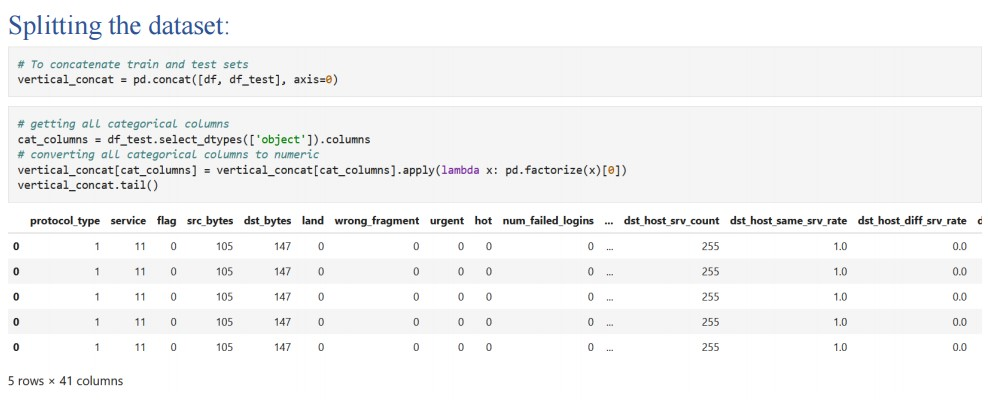
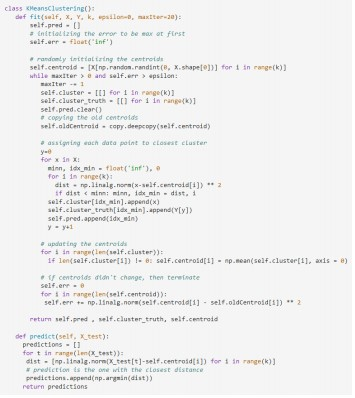
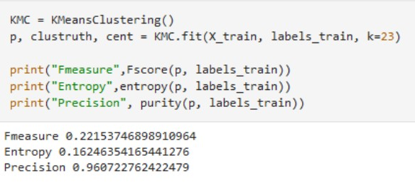

# Anomaly-detection
Implementing an Anomaly detection model from scratch, implementing Kmeans, mini batch kmeans, Normalized cut, Agglomerative hierarchical clustering and some evaluation measures.

The exponential growth of network traffic has led to an increase in network anomalies, such as cyber attacks, network failures, and hardware malfunctions.
Network anomaly detection is a critical task for maintaining the security and stability of computer networks.

### About the dataset
KDD Cup 1999 Data, this is the data set used for The Third International Knowledge Discovery and Data Mining Tools Competition, which was held in conjunction with KDD-99 The Fifth International Conference on Knowledge Discovery and Data Mining. The competition task was to build a network intrusion detector, a predictive model capable of distinguishing between bad'' connections, called intrusions or attacks, and good'' normal connections. This database contains a standard set of data to be 
audited, which includes a wide variety of intrusions simulated in a military network environment.

Each data point is composed of 41 dimensions detailing the intrusion, its properties, and its type. Here we are using a smaller portion of the data set (10%) to facilitate the computation and decrease the required resources.

### Screenshots
Reading the dataset

Kmeans

Evaluation

